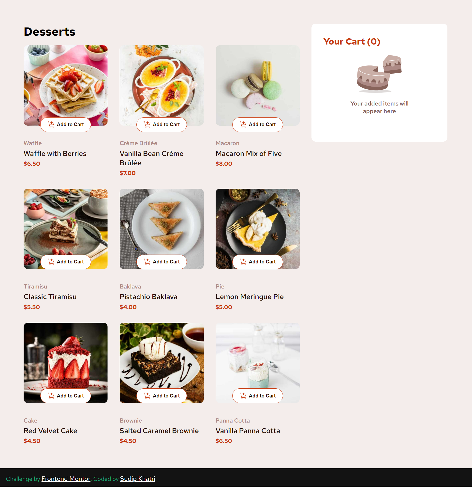
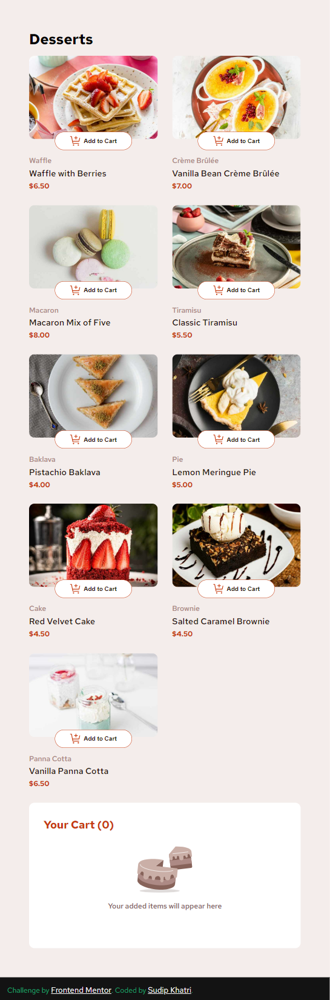

# Frontend Mentor - Product list with cart solution

This is a solution to the [Product list with cart challenge on Frontend Mentor](https://www.frontendmentor.io/challenges/product-list-with-cart-5MmqLVAp_d). Frontend Mentor challenges help you improve your coding skills by building realistic projects.

## Table of contents

- [Overview](#overview)
  - [The challenge](#the-challenge)
  - [Screenshot](#screenshot)
  - [Links](#links)
- [My process](#my-process)
  - [Built with](#built-with)
  - [What I learned](#what-i-learned)
  - [Useful resources](#useful-resources)
- [Author](#author)

## Overview

### The challenge

Users should be able to:

- Add items to the cart and remove them
- Increase/decrease the number of items in the cart
- See an order confirmation modal when they click "Confirm Order"
- Reset their selections when they click "Start New Order"
- View the optimal layout for the interface depending on their device's screen size
- See hover and focus states for all interactive elements on the page

### Screenshot

### Links

- Solution URL: [https://www.frontendmentor.io/solutions/responsive-interactive-product-listing-with-carts-Bdpi0g3009](https://www.frontendmentor.io/solutions/responsive-interactive-product-listing-with-carts-Bdpi0g3009)
- Live Site URL: [https://projectlistwithcart.netlify.app/](https://projectlistwithcart.netlify.app/)

## My process

### Built with

- Semantic HTML5 markup
- CSS custom properties
- Flexbox
- CSS Grid
- Media query

### What I learned

In this project i sharpened my knowledge in DOM Manipulation, Dataset objects, Asynchronous Javascript, Fetch Api and Array Methods, CSS Grid etc

### Useful resources

- [Stack OverFlow](https://stackoverflow.com/) - This helped me for many of my confusion and mistakes correction . I really liked this pattern and will use it going forward.
- [ChatGpt](https://chatgpt.com/) - This also helped me to remember some methods and usecases. I really liked this pattern and will use it going forward.

## Author

- Website - [@SudipKhatri](https://sudipkhatri.netlify.app/)
- Frontend Mentor - [@SudipKhatri036](https://www.frontendmentor.io/profile/SudipKhatri036)
- Linkedin - [@SudipKhatri](https://www.linkedin.com/in/sudip-khatri-a72a6a27b/)
